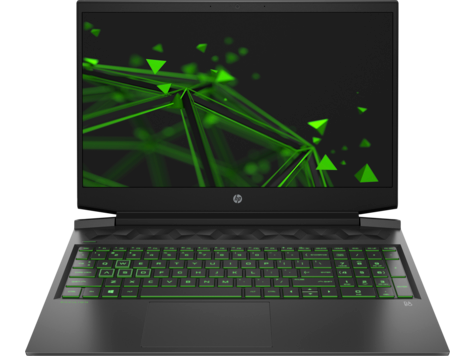
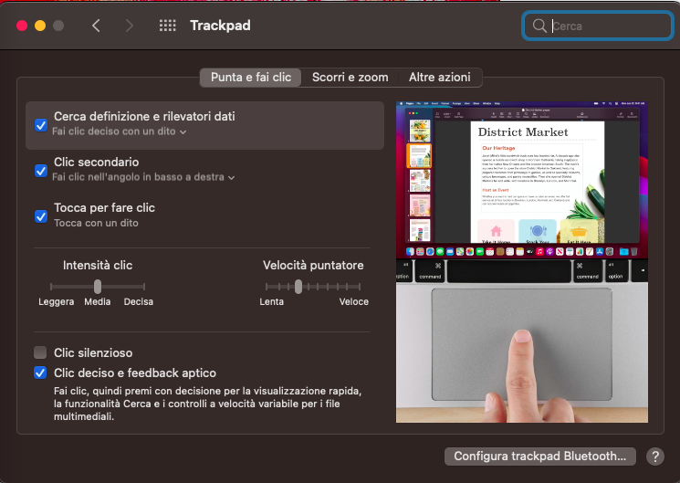
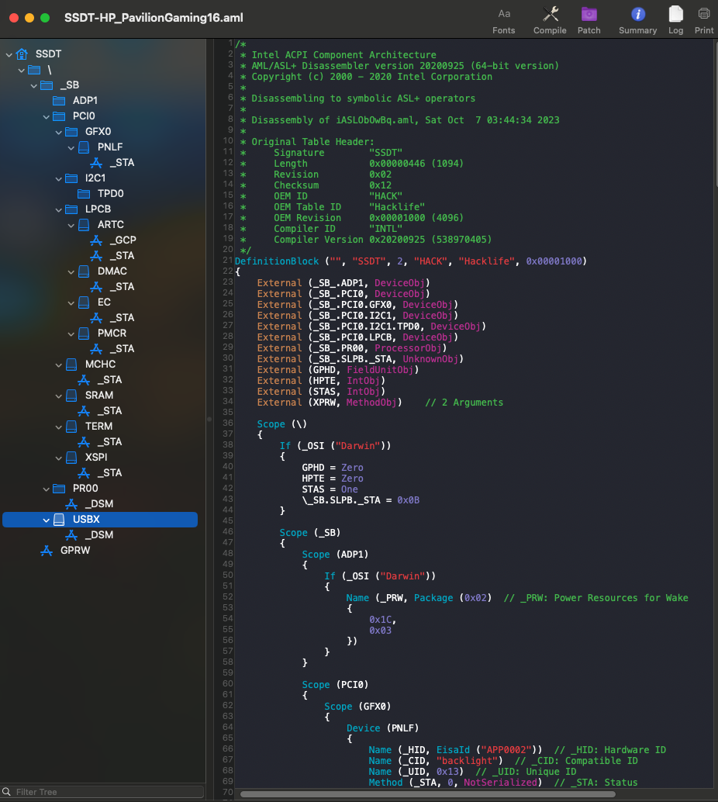
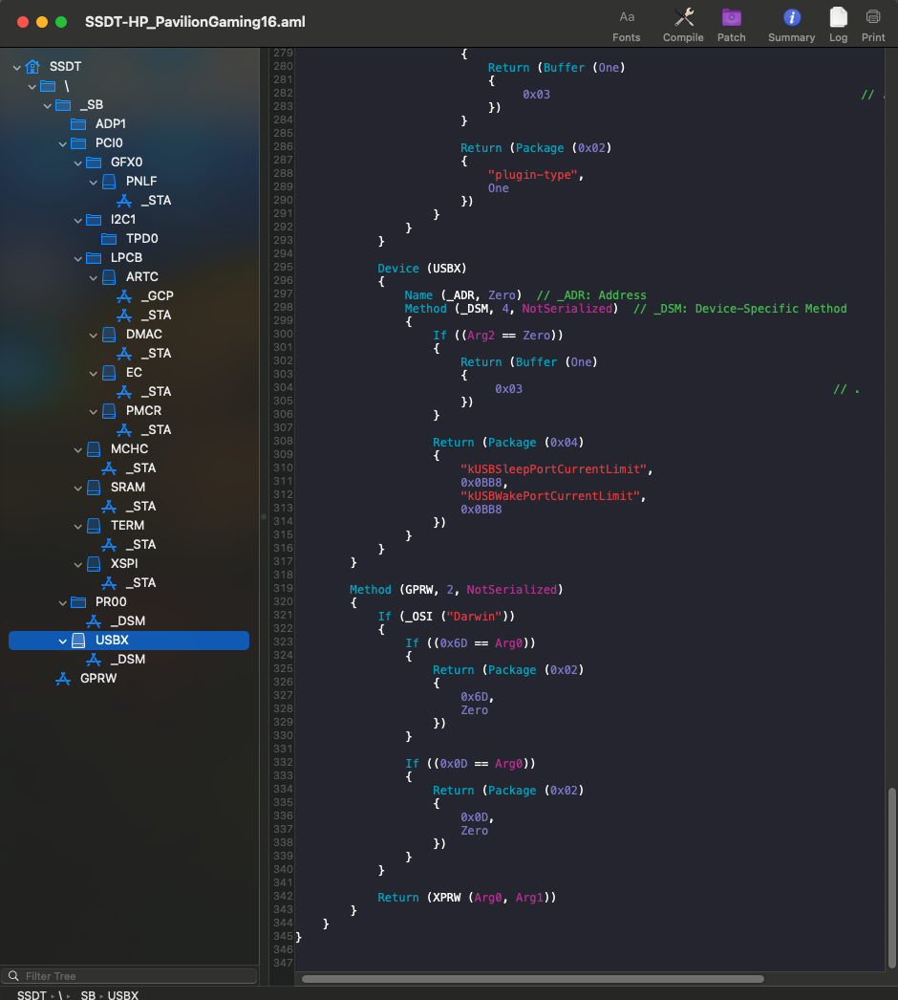

[](https://github.com/Baio1977?tab=repositories)
[](https://t.me/HackintoshLife_it)

# HP16 Pavilion Gaming



## Computer Spec:

| Component          | Brank                               |
| ------------------ | ----------------------------------  |
| CPU                | Intel® i7-10750H (CometLake)        |
| IGPU               | Intel® UHD Graphics 630             |
| dGPU               | Nvidia 1060 GTX (disabled on macOs) |
| Display            | 1920x1080                           |
| Audio              | Realtek ALC 245 |
| Ram                | 16GB                                |
| SSD                | Kingstone A400 128gb                |
| SmBios             | MacbookPro 16,4                     |
| BootLoader         | OpenCore                            |

### Trackpad

## Patch ACPI 

```swift
Scope (I2C1)
{
    If (_OSI ("Darwin"))
    {
        Name (USTP, One)
    }
    
    Scope (TPD0)
    {
        If (_OSI ("Darwin"))
        {
             Name (OSYS, 0x07DC)
        }        
    }
}     
```               


## SSDT Full Hack




# If you need help please contact us on [Telegram](https://t.me/HackintoshLife_it) or [Web](https://www.hackintoshlife.it/)
